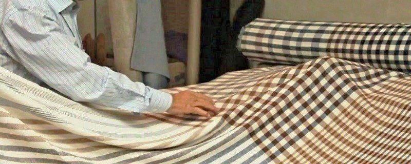

# Novalan site — page template & class reference

Written by the foundation build (`assets/css/site.css`, `assets/js/site.js`, `index.html`,
`en/index.html`). **Every other page is built from this file.** Everything below is verified
against the shipped CSS — if a class is not listed here, it does not exist.

Read `_source/BUILD_CONTRACT.md` and `_source/CONTENT.md` first. This file adds nothing to the
content rules; it only tells you what markup to paste and what classes are available.

---

## 0. Ground rules that bite

| Rule | Why |
| --- | --- |
| **Paths are relative, never leading `/`.** Root pages use `assets/…`, `en/` pages use `../assets/…`. | Pages must open off `file://`. |
| `site.js` adds `.nv-js` to `<html>`. `.nv-reveal` only hides itself when that class is present. | No-JS pages still read. |
| The design system's `tokens/base.css` defines `.nv-rule` as a bare 1 px hairline. `site.css` **overrides** it into the labelled rule. For a plain hairline use `<hr class="nv-hairline">`. | Name collision, already handled — just don't fight it. |
| `.nv-figures` (key-figures strip) and `.nv-figure` (image frame) are **different components**. | Contract names both. |
| Never put text in `--nv-khaki-500` on paper — fails AA. Khaki text is only allowed on ink (`--nv-khaki-300`, which the `data-nv-theme="ink"` scope already sets as `--text-accent`). | Contract §6. |
| Khaki at scale **once per view**. On the home page that is the hero's accent button. If your page has a hero accent button, don't add a second khaki mass. | Design system. |
| No raw hex, no `rgba()` in any CSS you add. If you need a new colour, compose it with `color-mix(in srgb, var(--nv-…) N%, transparent)` like section 01 of `site.css` does. | Contract §4. |
| Every ``: real `alt` from CONTENT §6, explicit `width`/`height`, `loading="lazy" decoding="async"` — **except** the hero image, which gets `fetchpriority="high"` and no lazy. | Contract §4/§6. |
| One `<h1>` per page (the hero title). Sections are `<h2>`, items inside them `<h3>`. Footer column heads are `<h2>`. | Contract §1. |
| Icons: inline `<svg class="nv-icon" width="16" height="16" viewBox="0 0 24 24" aria-hidden="true">`. The class supplies `fill:none`, `stroke:currentColor`, `stroke-width:1.25`. | Contract §1. |

---

## 1. Head boilerplate

**Root (es-MX) page** — replace the four `…` slots:

```html
<!DOCTYPE html>
<html lang="es-MX" dir="ltr">
<head>
<meta charset="utf-8">
<meta name="viewport" content="width=device-width, initial-scale=1">
<title>… · Novalan, S.A. de C.V.</title>
<meta name="description" content="…">
<link rel="alternate" hreflang="es-MX" href="PAGE.html">
<link rel="alternate" hreflang="en" href="en/PAGE.html">
<link rel="icon" href="assets/img/favicon.svg" type="image/svg+xml">
<link rel="preload" as="font" type="font/woff2" crossorigin
      href="assets/fonts/bodoni-moda-400-normal-aFTQ7PxzY382XsXX63LUYJSKSKg.woff2">
<link rel="stylesheet" href="assets/css/novalan-tokens.css">
<link rel="stylesheet" href="assets/css/site.css">
<meta property="og:title" content="…"><meta property="og:type" content="website">
<meta property="og:image" content="assets/img/fabric/hero-1900.jpg">
</head>
<body>
<a class="nv-skip" href="#main">Saltar al contenido</a>
…header… …drawer… <main id="main">…</main> …footer…
<script src="assets/js/site.js" defer></script>
</body>
</html>
```

**`en/` page**: `lang="en"`, skip-link text `Skip to content`, and every `assets/…`,
`novalan-tokens.css`, `site.css`, `site.js`, favicon and og:image path gains `../`.
`hreflang` pairs become `href="../PAGE.html"` (es-MX) and `href="PAGE.html"` (en).

The **JSON-LD `Organization` block is home pages only** — it is already in `index.html` and
`en/index.html`. Do not repeat it on interior pages.

Page-file pairs:

| ES (root) | EN (`en/`) |
| --- | --- |
| `index.html` | `en/index.html` |
| `nosotros.html` | `en/about.html` |
| `productos.html` | `en/products.html` |
| `procesos.html` | `en/processes.html` |
| `contacto.html` | `en/contact.html` |

---

## 2. Header — copy verbatim

Set `aria-current="page"` on the nav link for the current page (or on `.nv-header__cta` when the
current page is Contacto/Contact). ES version shown; the EN version is identical with the EN labels,
EN hrefs, `../assets/…` image paths, and the `ES`/`EN` halves of `.nv-lang` swapped so the **current
language is the plain `<span>` and the other language is the `<a>` to its counterpart page**.

```html
<header class="nv-header">
  <div class="nv-header__inner nv-container">
    <a class="nv-header__brand" href="index.html" aria-label="Novalan — Inicio">
      
    </a>

    <nav class="nv-nav" aria-label="Navegación principal">
      <a class="nv-nav__link" href="nosotros.html">Quiénes somos</a>
      <a class="nv-nav__link" href="productos.html">Productos</a>
      <a class="nv-nav__link" href="procesos.html">Procesos</a>
    </nav>

    <div class="nv-header__actions">
      <p class="nv-lang">
        <span class="nv-lang__current" lang="es-MX">ES</span>
        <span class="nv-lang__sep" aria-hidden="true">/</span>
        <a class="nv-lang__link" href="en/index.html" lang="en" hreflang="en">EN</a>
      </p>
      <a class="nv-btn nv-btn--secondary nv-btn--sm nv-header__cta" href="contacto.html">Contacto</a>
      <button class="nv-burger" type="button" aria-expanded="false" aria-controls="nv-drawer" data-nv-drawer-toggle>
        <span class="nv-sr-only">Menú</span>
        <span class="nv-burger__box" aria-hidden="true">
          <span class="nv-burger__bar"></span>
          <span class="nv-burger__bar"></span>
        </span>
      </button>
    </div>
  </div>
</header>
```

> The header nav carries **three** links; Contacto lives in the secondary-variant button on the
> right, per contract §4. All four links appear in the drawer and in the footer.

### Mobile drawer — paste immediately after `</header>`

```html
<div class="nv-drawer" id="nv-drawer" data-nv-drawer>
  <div class="nv-drawer__scrim" data-nv-drawer-close></div>
  <div class="nv-drawer__panel" role="dialog" aria-modal="true" aria-label="Navegación">
    <div class="nv-drawer__head">
      
      <button class="nv-drawer__close" type="button" data-nv-drawer-close aria-label="Cerrar el menú">
        <span aria-hidden="true">&times;</span>
      </button>
    </div>
    <nav class="nv-drawer__nav" aria-label="Navegación móvil">
      <a class="nv-drawer__link" href="nosotros.html">Quiénes somos</a>
      <a class="nv-drawer__link" href="productos.html">Productos</a>
      <a class="nv-drawer__link" href="procesos.html">Procesos</a>
      <a class="nv-drawer__link" href="contacto.html">Contacto</a>
    </nav>
    <div class="nv-drawer__foot">
      <p class="nv-label">Contacto</p>
      <a href="tel:+527757551123">(52) 775-755-11-23</a>
      <a href="tel:+527757530389">(52) 775-753-03-89</a>
      <a href="mailto:info@novalanfabrics.com.mx">info@novalanfabrics.com.mx</a>
      <p class="nv-lang">
        <span class="nv-lang__current" lang="es-MX">ES</span>
        <span class="nv-lang__sep" aria-hidden="true">/</span>
        <a class="nv-lang__link" href="en/index.html" lang="en" hreflang="en">EN</a>
      </p>
    </div>
  </div>
</div>
```

---

## 3. Footer — copy verbatim

```html
<footer class="nv-footer" data-nv-theme="ink">
  <div class="nv-footer__inner nv-container">
    <div class="nv-footer__brand">
      
      <p class="nv-footer__desc">Fabricación y venta de tejidos de moda en lana y mezclas, hilos, tapicería y tejidos técnicos.</p>
    </div>

    <nav class="nv-footer__col" aria-label="Navegación del pie de página">
      <h2 class="nv-footer__head">Navegación</h2>
      <ul class="nv-footer__list">
        <li><a class="nv-footer__link" href="nosotros.html">Quiénes somos</a></li>
        <li><a class="nv-footer__link" href="productos.html">Productos</a></li>
        <li><a class="nv-footer__link" href="procesos.html">Procesos</a></li>
        <li><a class="nv-footer__link" href="contacto.html">Contacto</a></li>
      </ul>
    </nav>

    <div class="nv-footer__col">
      <h2 class="nv-footer__head">Contacto</h2>
      <address class="nv-footer__addr">
        Carr. Tulancingo-Huapalcalco #1510<br>
        Col. Caltengo<br>
        Tulancingo, Hidalgo. México<br>
        C.P.: 43626
      </address>
      <ul class="nv-footer__list">
        <li><a class="nv-footer__link" href="tel:+527757551123">(52) 775-755-11-23</a></li>
        <li><a class="nv-footer__link" href="tel:+527757530389">(52) 775-753-03-89</a></li>
        <li><a class="nv-footer__link" href="mailto:info@novalanfabrics.com.mx">info@novalanfabrics.com.mx</a></li>
        <li><a class="nv-footer__link" href="MAPS_URL" target="_blank" rel="noopener noreferrer">Ver mapa</a></li>
      </ul>
    </div>

    <div class="nv-footer__col">
      <h2 class="nv-footer__head">Grupo</h2>
      <ul class="nv-footer__list">
        <li>Novalan, S.A. de C.V.</li>
        <li>San Ildefonso Fábrica de Tejidos de Lana, S.A. de C.V.</li>
      </ul>
    </div>
  </div>

  <div class="nv-container">
    <hr class="nv-footer__rule">
    <div class="nv-footer__bottom">
      <span>© Todos los derechos reservados. Novalan, S.A. de C.V.</span>
      <span>Tulancingo, Hidalgo · México</span>
    </div>
  </div>
</footer>
```

EN footer: heads `Navigation` / `Contact` / `Group`, descriptor
*"Manufacture and sale of wool fashion fabrics and blends, upholstery, technical textiles and yarns."*,
map label `See Map`, copyright `© All rights reserved. Novalan, S.A. de C.V.`

`MAPS_URL` is the single Google Maps place URL from CONTENT §0 — copy it out of `index.html`,
do not retype it.

---

## 4. Labelled rule

```html
<div class="nv-rule" role="presentation"><span class="nv-rule__label">Historia</span><i></i><span class="nv-rule__index">01 / 05</span></div>
```

- The `<i></i>` is the flexing hairline. `<span class="nv-rule__line"></span>` works identically.
- `.nv-rule__index` is optional — use it only where the section is a numbered sequence, and keep the
  count consistent across the whole page (`01 / 05`, `02 / 05`, …). It hides below 560 px.
- Wrap rule + heading + lede in `.nv-section__head` for the standard spacing:

```html
<div class="nv-section__head">
  <div class="nv-rule" role="presentation">…</div>
  <h2 id="…-title">Nuestros Procesos</h2>
  <p class="nv-lede nv-prose">…</p>
</div>
```

- Section shell: `<section class="nv-section nv-container" id="…" aria-labelledby="…-title">`.
  Add `nv-section--flush-top` when the previous section already supplied the air.

---

## 5. Hero

Every page gets one. **Hero images always come from `img/fabric/`** (1600–1900 px). The plinth
below the image is where the script tagline lockup goes on the home pages; on interior pages you may
drop `.nv-hero__plinth` entirely or keep it with just the `.nv-hero__cue` link.

```html
<section class="nv-hero">
  <div class="nv-hero__media">
    <picture>
      <source type="image/webp" srcset="assets/img/fabric/SLUG-1600.webp">
      
    </picture>
    <span class="nv-hero__veil" aria-hidden="true"></span>
    <span class="nv-hero__protect" aria-hidden="true"></span>

    <div class="nv-hero__inner nv-container" data-nv-theme="ink">
      <p class="nv-label nv-hero__eyebrow">Tulancingo, Hidalgo · México</p>
      <h1 class="nv-hero__title">…</h1>
      <p class="nv-hero__standfirst">…</p>
      <div class="nv-hero__actions">
        <a class="nv-btn nv-btn--accent" href="…">…</a>
        <a class="nv-btn nv-btn--secondary" href="…">…</a>
      </div>
    </div>
  </div>

  <div class="nv-hero__plinth nv-container">
    
    <a class="nv-hero__cue" href="#SECTION_ID">
      Nuestra Historia
      <svg class="nv-icon" width="16" height="16" viewBox="0 0 24 24" aria-hidden="true"><path d="M12 5v14"/><path d="m19 12-7 7-7-7"/></svg>
    </a>
  </div>
</section>
```

- `data-nv-theme="ink"` on `.nv-hero__inner` is what makes the eyebrow khaki and the
  `--secondary` button paper-outlined. Do not remove it.
- Ratios are automatic: 21:9 → 3:2 below 900 px → 4:5 below 560 px.
- `.nv-hero--compact` on the `<section>` gives a shallower 21:7 desktop crop for interior pages.
- **The lockup PNG is black artwork** — it only reads on the paper plinth, never over the image.

---

## 6. JS hooks (`assets/js/site.js`)

The script runs on every page and no-ops where the markup is absent. It reads these attributes:

| Attribute | On | Purpose |
| --- | --- | --- |
| `data-nv-drawer` | drawer root `.nv-drawer` | drawer container |
| `data-nv-drawer-toggle` | `.nv-burger` | opens/closes, gets `aria-expanded` |
| `data-nv-drawer-close` | scrim + close button | closes |
| `data-nv-video`, `data-nv-video-id`, `data-nv-video-title` | `.nv-video` | facade → `youtube-nocookie` iframe |
| `data-nv-lightbox` | `.nv-lightbox` root | the single reused dialog |
| `data-nv-lightbox-open` + `data-nv-src`, `data-nv-src-webp`, `data-nv-caption`, `data-nv-alt` | each fabric card/button | one entry in the sequence |
| `data-nv-lightbox-img`, `-source`, `-caption`, `-index`, `-close`, `-prev`, `-next` | inside the dialog | slots the script fills / wires |

Behaviour supplied for free: Esc closes, ← → step, scrim click closes, focus trapped, focus restored
to the opening card, body scroll locked, header `.is-scrolled` past 8 px, `.nv-reveal` → `.is-visible`
once on intersect (short-circuited under `prefers-reduced-motion`).

### Corporate-video facade

```html
<div class="nv-video" data-nv-video data-nv-video-id="f6LBXP9IJSg" data-nv-video-title="Video Corporativo · Novalan, S.A. de C.V.">
  <button class="nv-video__facade" type="button">
    <picture>
      <source type="image/webp" srcset="assets/img/photo/procesos_foto_1.webp">
      
    </picture>
    <span class="nv-video__veil" aria-hidden="true"></span>
    <span class="nv-video__play" aria-hidden="true">
      <svg class="nv-icon" width="20" height="20" viewBox="0 0 24 24"><polygon points="7 4 20 12 7 20 7 4"/></svg>
    </span>
    <span class="nv-video__label">Video Corporativo</span>
    <span class="nv-sr-only">Reproducir el video corporativo de Novalan en YouTube</span>
  </button>
</div>
```

### Lightbox shell (products page) — one per page, place just before `</body>`

```html
<div class="nv-lightbox" data-nv-lightbox data-nv-theme="ink">
  <div class="nv-lightbox__scrim" data-nv-lightbox-close></div>
  <div class="nv-lightbox__dialog" role="dialog" aria-modal="true" aria-label="Telas">
    <div class="nv-lightbox__top">
      <button class="nv-lightbox__close" type="button" data-nv-lightbox-close aria-label="Cerrar">
        <span aria-hidden="true">&times;</span>
      </button>
    </div>
    <figure class="nv-lightbox__figure">
      <picture>
        <source type="image/webp" data-nv-lightbox-source srcset="">
        
      </picture>
    </figure>
    <div class="nv-lightbox__bar">
      <span class="nv-lightbox__caption" data-nv-lightbox-caption></span>
      <div class="nv-lightbox__nav">
        <button class="nv-lightbox__step" type="button" data-nv-lightbox-prev aria-label="Anterior">
          <svg class="nv-icon" width="18" height="18" viewBox="0 0 24 24" aria-hidden="true"><path d="m15 18-6-6 6-6"/></svg>
        </button>
        <button class="nv-lightbox__step" type="button" data-nv-lightbox-next aria-label="Siguiente">
          <svg class="nv-icon" width="18" height="18" viewBox="0 0 24 24" aria-hidden="true"><path d="m9 18 6-6-6-6"/></svg>
        </button>
      </div>
      <span class="nv-lightbox__index" data-nv-lightbox-index></span>
    </div>
  </div>
</div>
```

Each opener (a `<button>` wrapping the `-800` thumbnail):

```html
<button class="nv-card nv-card--interactive" type="button"
        data-nv-lightbox-open
        data-nv-src="assets/img/fabric/SLUG-1600.jpg"
        data-nv-src-webp="assets/img/fabric/SLUG-1600.webp"
        data-nv-caption="Telas de lana peinada y sus mezclas"
        data-nv-alt="…from CONTENT §6…">
  …figure + .nv-card__body…
</button>
```

---

## 7. Class inventory (`assets/css/site.css`)

Everything the stylesheet defines. Modifiers are listed with their base.

### Layout
| Class | Does | Modifiers |
| --- | --- | --- |
| `.nv-container` | 1440 max width, auto margins, `--page-margin` side padding | — |
| `.nv-section` | `--section-y` top and bottom padding | `--tight` (64 px), `--flush-top`, `--flush-bottom` |
| `.nv-section__head` | rule + heading + lede cluster with standard bottom air | — |
| `.nv-prose` | caps a text column at `--container-text` (64ch); last `<p>` loses its margin | `--wide` (76ch) |
| `.nv-split` | two-column editorial layout, collapses at 900 px | `--aside` (1.35 / 1), `--even` (1 / 1), `--reverse` |
| `.nv-grid-2` `.nv-grid-3` `.nv-grid-4` | equal-column grids on `--gutter`; 4→3 at 1180, 3/4→2 and 2→1 at 900, all →1 at 560 | `.nv-grid--gap-lg`, `.nv-grid--gap-sm` |
| `.nv-stack` | vertical grid stack, `--space-5` gap | `--sm`, `--lg` |
| `.nv-actions` | flex row of buttons/links, wraps | — |
| `.nv-list-reset` | strips list markers and padding | — |
| `.nv-sr-only` | visually hidden, still announced | — |

### Type
| Class | Does | Modifiers |
| --- | --- | --- |
| `.nv-label` | the micro-label: 10 px, uppercase, `--ls-label`, muted, zero margin | `--lg` (11 px), `--tight` (`--ls-label-tight`), `--accent`, `--ink` |
| `.nv-mono` | mono family + tabular numerals — wrap **every** number in it | — |
| `.nv-h1` `.nv-h2` `.nv-h3` `.nv-h4` | display type roles for non-heading elements | — |
| `.nv-lede` | 18 px standfirst paragraph in `--text-secondary` | — |
| `.nv-muted` | body copy in `--text-secondary` | — |
| `.nv-hairline` | a plain 1 px rule (`<hr>` or `<span>`) | `--strong`, `--accent` |
| `.nv-link-arrow` | uppercase micro-label link with an underline that darkens on hover | — |
| `.nv-icon` | inline SVG: `fill:none`, `stroke:currentColor`, `stroke-width:1.25` | — |

### Chrome
| Class | Does |
| --- | --- |
| `.nv-skip` | fixed skip link, slides in on focus |
| `.nv-header` | sticky paper bar, hairline bottom, `z-index:30`; `.is-scrolled` (added by JS past 8 px) darkens the hairline |
| `.nv-header__inner` | 82 px flex row (64 px below 900 px) |
| `.nv-header__brand` / `.nv-header__logo` | home link + 132 px wordmark |
| `.nv-nav` / `.nv-nav__link` | centre nav; `[aria-current="page"]` gives ink colour + solid ink underline; hidden below 900 px |
| `.nv-header__actions` | right cluster |
| `.nv-lang`, `.nv-lang__current`, `.nv-lang__sep`, `.nv-lang__link` | ES / EN switch; current language is the plain span |
| `.nv-header__cta` | the secondary button to Contacto; `[aria-current="page"]` fills it ink; hidden below 900 px |
| `.nv-burger`, `.nv-burger__box`, `.nv-burger__bar` | hamburger, visible only below 900 px |

### Drawer
`.nv-drawer` (`.is-open`), `.nv-drawer__scrim`, `.nv-drawer__panel`, `.nv-drawer__head`,
`.nv-drawer__logo`, `.nv-drawer__close`, `.nv-drawer__nav`, `.nv-drawer__link`
(Bodoni 28 px, hairline-separated, `[aria-current="page"]` goes walnut), `.nv-drawer__foot`.
Full-height paper panel on the right, `--scrim-ink` + `--blur-veil` behind it.
JS adds `body.nv-no-scroll` while it is open.

### Footer
`.nv-footer` (needs `data-nv-theme="ink"`), `.nv-footer__inner` (1.4fr + 3 columns),
`.nv-footer__brand`, `.nv-footer__mark` (150 px), `.nv-footer__desc`, `.nv-footer__col`,
`.nv-footer__head` (khaki-300 micro-label), `.nv-footer__list`, `.nv-footer__link`,
`.nv-footer__addr`, `.nv-footer__rule`, `.nv-footer__bottom` (10 px uppercase, muted).

### Hero
`.nv-hero`, `.nv-hero__media` (21:9 → 3:2 → 4:5), `.nv-hero__img`, `.nv-hero__veil`
(left-to-right ink gradient), `.nv-hero__protect` (`--protect-bottom`), `.nv-hero__inner`,
`.nv-hero__eyebrow`, `.nv-hero__title` (Bodoni `clamp(40px, 6vw, 76px)`, max 18ch),
`.nv-hero__standfirst` (max 52ch), `.nv-hero__actions`, `.nv-hero__plinth` (paper strip under the
image), `.nv-hero__lockup`, `.nv-hero__cue` (hidden below 560 px).
Modifier: `.nv-hero--compact` → 21:7 desktop crop.

### Components
| Class | Does | Modifiers |
| --- | --- | --- |
| `.nv-rule` | labelled hairline; children `.nv-rule__label`, `<i>` or `.nv-rule__line`, `.nv-rule__index` | `--accent`, `--strong` |
| `.nv-btn` | 44 px square control, 11 px uppercase; press = `opacity:.86` | `--ink` (ink→walnut), `--accent` (khaki→khaki-700), `--secondary` (solid hairline, 4 % wash), `--ghost`, `--link`, `--sm` (32 px), `--lg` (52 px), `--block` |
| `.nv-card` | white, 1 px hairline, square, no shadow. Children `.nv-card__body`, `.nv-card__title`, `.nv-card__meta`, `.nv-card__link` (stretched hit area) | `--interactive` (hairline darkens, `--shadow-hover`, inner image scales 1.04), `--flush` (no ground, no border) |
| `.nv-figure` | `<figure>` wrapper; holds `.nv-figure__frame` (ratio box, ink ground, overflow hidden), `.nv-figure__img` (`object-fit:cover`), `.nv-figure__caption` (micro-label, sits outside the frame) | ratio: `--4x5` `--1x1` `--3x2` `--16x10` (default) `--19x10` `--21x9`; `--hover` scales the image on hover outside a card |
| `.nv-figures` | key-figures strip: 5 columns of `.nv-figures__item` (`.nv-figures__label` above `.nv-figures__num`), hairline-separated, 5 → 3 → 2 → 1 columns | `--4` (four-column variant with correct row resets) |
| `.nv-spec` | `<dl>` of `.nv-spec__row` (`.nv-spec__label` / `.nv-spec__value`), hairline between rows; value is mono by default | `--dense`, `--stacked`; on the value: `.nv-spec__value--text` (body font instead of mono) |
| `.nv-tag` | 32 px hairline chip, uppercase micro-label | `--accent` (khaki hairline), `--selected` (ink fill) |
| `.nv-list` | hairline-separated list: `.nv-list__item` (`.nv-list__index` mono + `.nv-list__body` → `.nv-list__term`, `.nv-list__text`) — use it for the 8 values, the policies, the 5 stages | `--plain` (no index column), `--tight` |
| `.nv-quote` | Bodoni **italic** pull quote, max 24ch, hanging khaki hairline left; `.nv-quote__text`, `.nv-quote__attr`. **One per page.** | `--wide` (30ch) |
| `.nv-band` | full-bleed section with `--section-y` padding | `--ink` (ink ground; pair with `data-nv-theme="ink"`), `--image` (photo ground; needs `.nv-band__media` + `.nv-band__img` + `.nv-band__veil` + `.nv-band__protect`, content in `.nv-band__inner`) |
| `.nv-cta` | two-column contact layout used inside an ink band: `.nv-cta__body`, `.nv-cta__title`, `.nv-cta__aside`, `.nv-cta__addr` | — |
| `.nv-timeline` | vertical rail: `.nv-timeline__item` → `.nv-timeline__year` (mono) + `.nv-timeline__body` (hairline rail, square marker) → `.nv-timeline__title`, `.nv-timeline__text`, `.nv-timeline__figure` | — |
| `.nv-video` | 16:9 ink box; `.nv-video__facade` (button) holds `.nv-video__img`, `.nv-video__veil`, `.nv-video__play`, `.nv-video__label`. `.is-playing` (added by JS) hides the facade and reveals `.nv-video__frame`. `.nv-video__caption` sits below the box | — |
| `.nv-lightbox` | fixed modal, `.is-open` shows it. `.nv-lightbox__scrim`, `__dialog`, `__top`, `__close`, `__figure`, `__img`, `__bar`, `__caption`, `__index`, `__nav`, `__step` | — |
| `.nv-reveal` | fade + 12 px rise on intersect; `.is-visible` is the resting state | `--delay-1`, `--delay-2`, `--delay-3` |

### State classes set by JS
`.nv-js` (on `<html>`), `.is-scrolled` (header), `.is-open` (drawer, lightbox),
`.is-playing` (video), `.is-visible` (reveal), `body.nv-no-scroll` (scroll lock).

---

## 8. Asset inventory — real intrinsic sizes

Use these exact `width`/`height` values. **Note the two exceptions.**

`assets/img/fabric/` — all `-1600` are **1600 × 842**, all `-800` are **800 × 421**,
*except* `yarns-1600` and `yarns-800`, which are both **800 × 452**.
Heroes: `hero-1900` and `hero-alt-1900` are **1900 × 1000**.
Slugs: `fashion-apparel`, `worsted-wool`, `woolen-wool`, `blends`, `natural-stretch`, `uniform`,
`polyester-viscose`, `polyester`, `billiards`, `upholstery`, `blankets`, `yarns`, `technical`.

`assets/img/photo/` (never in a full-bleed hero — they are ≤ 1200 px):

| file | w × h | file | w × h |
| --- | --- | --- | --- |
| `inicio_foto_1` | 800 × 320 | `productos_foto_1` | 416 × 300 |
| `inicio_foto_2` | 800 × 254 | `productos_foto_2` | 416 × 300 |
| `inicio_foto_3` | 800 × 450 | `productos_foto_3` | 416 × 300 |
| `inicio_foto_4` | 416 × 300 | `productos_foto_4` | 416 × 300 |
| `inicio_foto_5` | 416 × 300 | `quienessomos_foto_1` | 416 × 372 |
| `procesos_hilatura` | 416 × 300 | `quienessomos_foto_2` | 416 × 372 |
| `procesos_tejido` | 416 × 300 | `quienessomos_foto_3` | 416 × 372 |
| `procesos_tenidoyacabado` | 416 × 300 | `quienessomos_foto_4` | 416 × 300 |
| `procesos_laboratorio` | 416 × 300 | `quienessomos_foto_5` | 416 × 300 |
| `procesos_diseno` | 416 × 300 | `quienessomos_foto_6` | 800 × 320 |
| `procesos_foto_1` | 800 × 320 | `quienessomos_foto_7` | 416 × 300 |
| | | `quienessomos_foto_8` | 416 × 300 |
| | | `quienessomos_foto_9` | 416 × 300 |

Because most photos are 416 × 300 (≈ 1.39), `.nv-figure--3x2` and `.nv-figure--4x5` crop them
gently; `.nv-figure--21x9` is right for the 800 × 320 and 800 × 254 files.

`assets/brand/`: `novalan-wordmark.png` 600 × 197 (black), `novalan-wordmark-light.png` 600 × 197
(paper), `novalan-lockup-wordmark.png` 600 × 88 (black), `novalan-lockup-tagline.png` 600 × 100
(**black** — paper grounds only).

---

## 9. Home-page section grammar to mirror

The home pages number their ruled sections `01 / 06` … `06 / 06`:
En cifras · Historia · *(quote band, no rule)* · Producción · Video · Secciones · Contacto.
Pick your own count per page, keep it consistent, and keep the same order of parts:
hero → labelled rule → heading → lede → content → (optional band) → ink CTA → footer.
